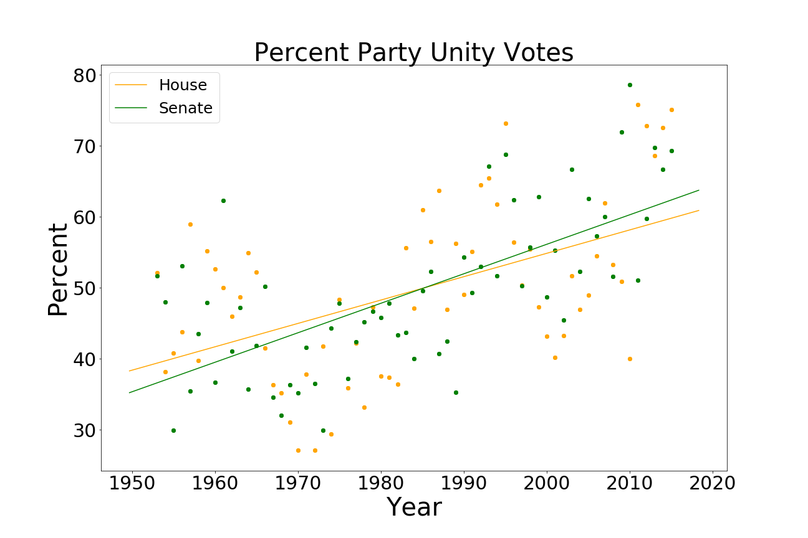

# Political Partisanship: A Look at the Data

The repo for an article I wrote on *Towards Data Science* in August - [Political Partisanship: A Look at the Data]
(https://towardsdatascience.com/political-partisanship-a-look-at-the-data-e71946199586). . 




## Files

The Jupyter notebooks  ```Partisanship_Final.ipynb``` contain the finalized version of the post, and ```Congress-Revisited-Raw.ipynb	Partisanship_Raw.ipynb``` contains exploratory analysis. 

```Congress-Revisited-Raw.ipynb``` is a work in progress. I'm currently tinkering with the data to see if I can generate new insights and write a follow-up post. 

## Dataset 

Using [Brookings’ Vital Statistics on Congress](https://www.brookings.edu/multi-chapter-report/vital-statistics-on-congress/), I examined data from Congressional party vote unity and ideological score differences from 1953 to 2015. See files in ```data/```.


